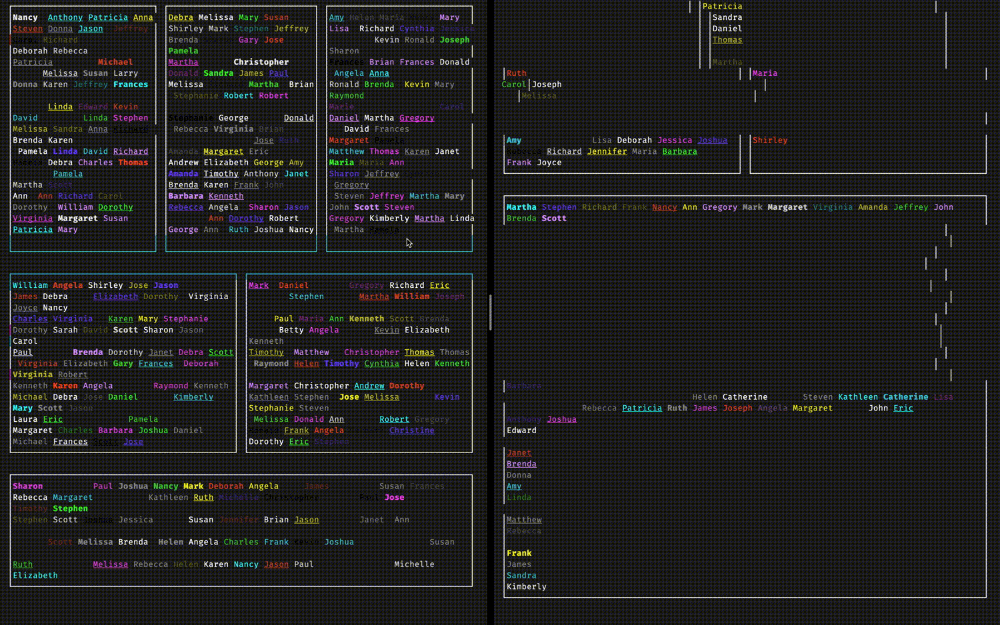

# ink-ansi

An alternative text component that avoids rendering control characters that mess with the layout in ink. It unfortunately also strips out any emoji, because ink is not able to correctly measure & thus layout text that includes emoji.

This is useful if you want to render the output of other terminal applications.

[](https://github.com/ForbesLindesay/ink-ansi/actions?query=workflow%3ATest+branch%3Amaster)
[](https://rollingversions.com/ForbesLindesay/ink-ansi)
[](https://www.npmjs.com/package/ink-ansi)

## Demo

The demo in src/demo.tsx renders this



On the left is what gets rendered by ink-ansi. You can see it mosty maintaining the correct layout. On the right is what is rendered with Ink's built in Text element. The control sequences, newlines, tabs etc. all break the layout.

## Installation

```
yarn add ink-ansi
```

## Usage

```ts
import AnsiText from 'ink-ansi';

// use <AnsiText> anwywhere you previously used <Text>
```
